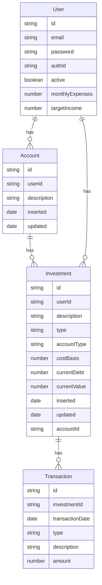

```mermaid
erDiagram
    User {
        string id
        string email
        string password
        string authId
        boolean active
        number monthlyExpenses
        number targetIncome
    }
    Account {
        string id
        string userId
        string description
        date inserted
        date updated
    }
    User ||--o{ Account : has
    Investment {
        string id
        string userId
        string description
        string type
        string accountType
        number costBasis
        number currentDebt
        number currentValue
        date inserted
        date updated
        string accountId
    }
    Account ||--o{ Investment : has
    User ||--o{ Investment : has
    Transaction {
        string id
        string investmentId
        date transactionDate
        string type
        string description
        number amount
    }
    Investment ||--o{ Transaction : has
```
